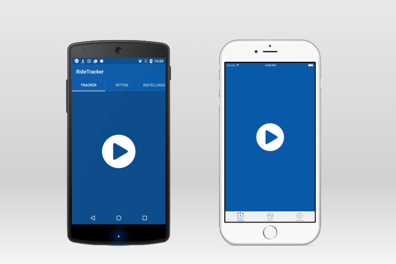

# Building a Geo Tracker App in Titanium

I have big plans this summer. I hope to cycle 400km through Rwanda (Africa) and raise €10,000 in funds for Compassion, a children aid charity. [Read more about these two challenges](http://fokkezb.nl/rwanda).

Obviously this means I'm on my bike a lot these days. I've been tracking all my rides using [Ride with GPS](https://ridewithgps.com) from the start, but a few weeks ago I wondered how easy it would be to build such a GPS tracker myself in Titanium.

So, I present to you...

## G.O. Tracker 4 Compassion

Pronounced *"geo" Tracker*, this initial version simply tracks your geolocation. You can view your previous routes on a map or browse through the individual data points. I plan to add more features in the next two months as I start to use the app for my own rides and hope to have it fairly complete by the time I go to Rwanda in June.

&nbsp;&nbsp;&nbsp;&nbsp;&nbsp;

## Learn from the source

As an Appcelerator Developer Evangelist I help developers to build Native Mobile Apps and APIs in JavaScript. One way I do this is by building and blogging about [sample apps](https://github.com/appcelerator-developer-relations).

In this spirit I [open sourced the app on GitHub](https://github.com/fokkezb/tracker) and as I continue to develop the app I will publish blog posts to guide you through the code and share some best practices.

## Contribute to the app...or to Compassion

I use [GitHub Issues](https://github.com/fokkezb/tracker/issues) to track planned features, enhancements and bugs. Feel free to contribute ideas there, or help me resolve them and send a PR. I will list the names of all contributors on the app's *Settings* screen.

Of course you are also more then welcome to [contribute to Compassion](http://fokkezb.nl/rwanda).

I'll follow up with the first blog post on the app source code soon.

Code Strong, Code with Compassion! 🚴

> This software is licensed under [MIT](http://choosealicense.com/licenses/mit/). Learn from it and use it in any way you want, as long as you include the copyright notice and permission notice in [LICENSE](LICENSE), including the link to [http://fokkezb.nl/rwanda](http://fokkezb.nl/rwanda). Also consider to [donate](https://www.muskathlon.com/en-us/athletes/1134/fokke-zandbergen.html) to Compassion.
